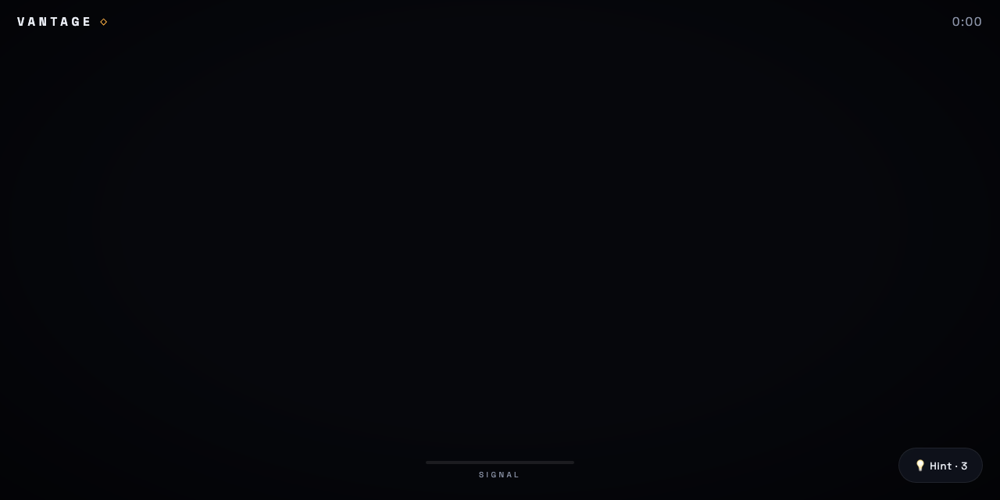

# VANTAGE

A daily perspective puzzle. The blocks look like chaos; from exactly one secret angle they align into a picture. Drag to orbit, the blocks glow warmer as you close in, find the vantage point.

  

**Try it: https://suncal.github.io/vantage/**

## What it does

- One puzzle per day from a date seed, same for everyone, Wordle-style
- Warmth feedback instead of hints, so every attempt teaches you something
- Verified solvable every day; perspective rays, billboarding and the emoji set are deliberate design decisions documented in `main.js`
- Two files, Three.js from a CDN, nothing to build

## Run it

Serve the folder (`python3 -m http.server`) and open `index.html`. Modules need http, not `file://`.

---

**If this is useful to you, a ⭐ on the repo helps other people find it.** Issues and pull requests are welcome.

Built by [Priyankar "Sunny" Chakraborty](https://github.com/suncal) · [everbuiltstudio.com](https://everbuiltstudio.com)
